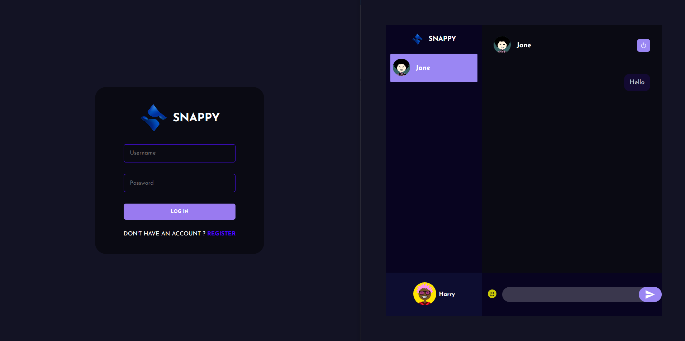

# Chat App With React and NodJS

This is a chat app build with react, nodejs and socket.io.

## Build Steps ⚙

This project was built with NodeJs -v 16.xx.

Running Locally 🖥️

1. Clone repo using the following command:
    ```shell script
    git clone <url> 
    ```
2. cd in project public directory
4. Install dependencies
    ```shell script
    npm install
    ```
5. Run front-end 🎉
    ```shell script
    npm start
	 ```
6. cd in project server directory
7. Install dependencies
    ```shell script
    npm install
    ```
7. Run front-end 🎉
    ```shell script
    npm run dev
	 ```